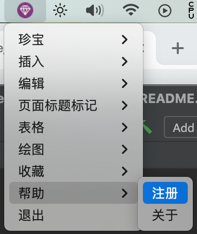
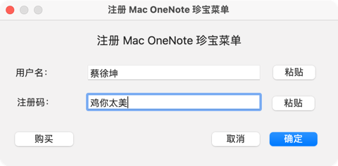
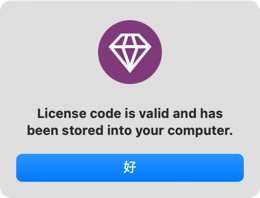
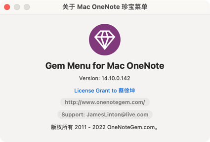
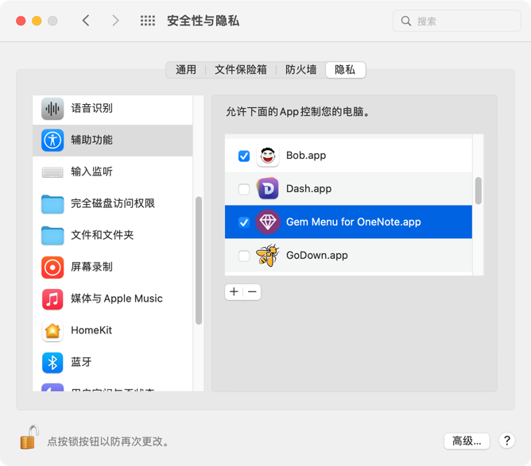

## 说明

### 安装

将 crack 文件夹中 Gem Menu for OneNote14.10.0.142.app.zip 解压得到 app，移动到 `mac应用程序` 完成安装。

### 破解说明

运行启动，在状态栏找到 app，点击注册：

输入任意字符完成注册：

破解成功：

### 注意

如果出现操作无效的情况，打开安全与隐私，删除Gem Menu for OneNote.app的辅助功能权限，再重新导入。

或者尝试重新安装官方正版，再用被 cracked 的 app 进行覆盖。